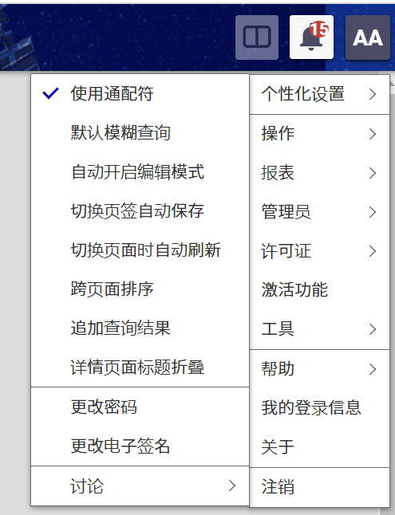
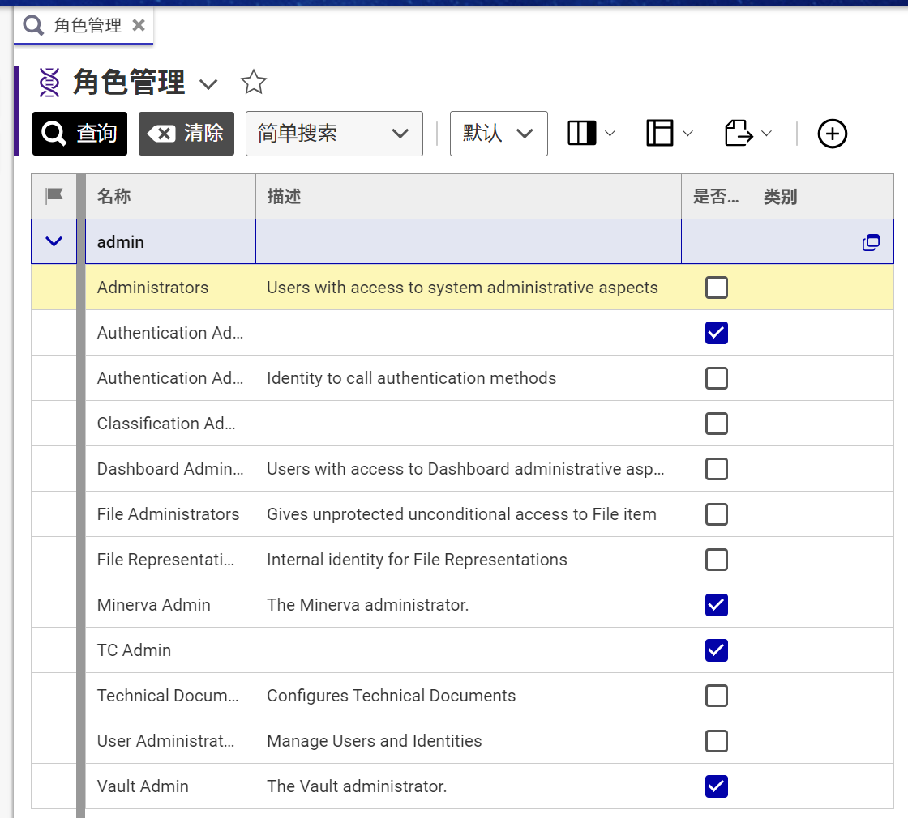
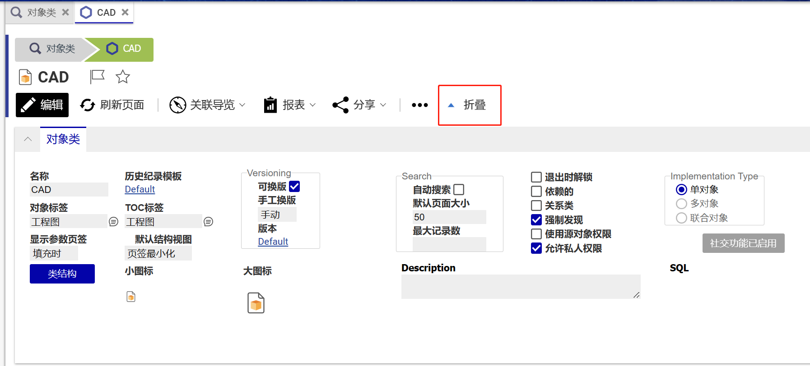
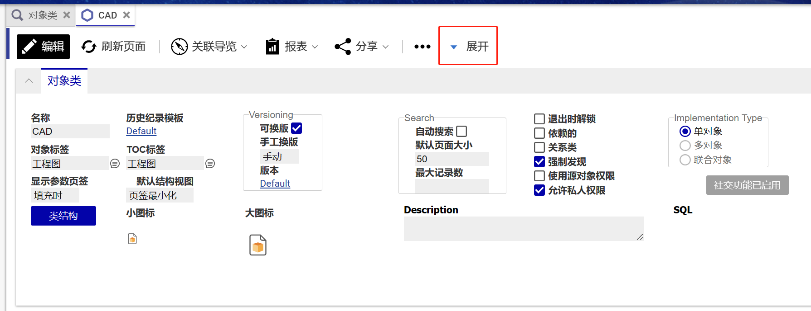

# 用户个性化功能

Aras Innovator用户个性化功能,其中包含 **默认模糊查询** **自动开启编辑模式** **切换页签自动保存** **切换页面自动刷新** **标题折叠**,用户可通过系统主页面右上角"个性化设置"菜单自行调整默认设置.

## 支持系统版本
Aras Innovator Version 22  Build: 14.0.8.35675

## 安装

#### 提醒!
**请提前备份数据库与CodeTree**

### 必备条件

1. Aras Innovator 已安装 (version 22)
2. Aras Package Import 导入工具

#### Code tree 安装步骤

1. 备份您的CodeTree并存储在安全的地方
2. 打开本地 `..\CustomPreferences\` 文件夹
3. 复制 `\Innovator\` 文件夹
4. 将其粘贴到安装目录的根目录
    + 默认情况下路径为 `C:\Program Files\Aras\Innovator\`

#### Database 安装步骤

1. 备份您的数据库并将BAK文件存储在安全的地方
2. 打开 Aras Package Import 工具
3. 输入Aras Innovator系统地址并点击 **Login**
4. 在弹出的登录页面中输入登录信息
4. 在 **TargetRelease** 控件中输入**包**的名称(可随意填写,建议填写 `CustomPreferences`)
    * 可选: 在 **Description** 控件中填写描述信息
5. 在 **Path** 控件中输入本地安装包路径 `..\CustomPreferences\Imports\CustomPreferences.mf` 
6. 在 **Available for Import** 控件中勾选 `CustomPreferences`
7. 选择 Type = **Merge** , Mode = **Thorough Mode**
8. 点击顶部左侧 **Import**
9. 等待导入成功后关闭 Aras Package Import 工具

####

现在您可以访问系统并使用用户个性化功能了

## 使用方式

### 默认模糊查询

1. 登录Aras Innovator系统
2. 点击右上角 **用户菜单** > **个性化设置** 
3. 点击 **默认模糊查询** 菜单,开启默认模糊查询模式
4. 进入对象搜索页面(支持对话框搜索页面)
5. 输入查询条件(不需要输入通配符`*`或`%`)
6. 执行搜索
7. 搜索结果中显示模糊查询结果

⚠️ **仅支持简单搜索模式**

### 自动开启编辑模式

1. 登录Aras Innovator系统
2. 点击右上角 **用户菜单** > **个性化设置**
3. 点击 **自动开启编辑模式** 菜单,开启自动开启编辑模式
4. 开启任意对象页面
5. 进入对象页面后对象将自动进入编辑状态

⚠️ **临时对象(新建且未保存的对象)与没有编辑权限的对象不会自动开启编辑模式**

### 切换页签自动保存

1. 登录Aras Innovator系统
2. 点击右上角 **用户菜单** > **个性化设置**
3. 点击 **切换页签自动保存** 菜单,开启切换页签自动保存模式
4. 开启任意对象页面
5. 点击编辑按钮进入编辑模式,修改任意属性内容
6. 切换关系页签,对象将自动保存

⚠️ **如果对象没有进行任何修改则切换页签时不会进行自动保存**

⚠️ **自动保存前会进行对象内容验证(验证必填属性是否有填写,属性值格式是否正确等),如验证不通过则不会进行自动保存**

### 切换页面自动刷新

1. 登录Aras Innovator系统
2. 点击右上角 **用户菜单** > **个性化设置**
3. 点击 **切换页面自动刷新** 菜单,开启切换页面自动刷新模式
4. 开启任意对象页面
5. 从任意页面切换到对象页面时,当前对象页面将自动刷新

⚠️ **如果当前对象有未保存的修改,则不会自动刷新**

### 标题折叠

1. 登录Aras Innovator系统
2. 点击右上角 **用户菜单** > **个性化设置**
3. 点击 **详情页面标题折叠** 菜单,开启标题自动折叠模式
4. 开启任意对象页面
5. 进入对象页面后,标题将自动折叠
6. 点击 **展开** 菜单可展开标题

⚠️ **如未开启自动折叠模式,也可在对象页面中点击折叠菜单手册折叠或展开**

## 技术交流 📣
[QQ群:197823386](http://qm.qq.com/cgi-bin/qm/qr?_wv=1027&k=9QBAR-Ra85m9l3GUxCX49rRFPWLs87FG&authKey=kdr98tqLBx2rF5swIO5%2BiKGQRJdLt8DZ5t2sSHY8pWfHhmjAioXEfWJfs4wShNfJ&noverify=0&group_code=197823386)

